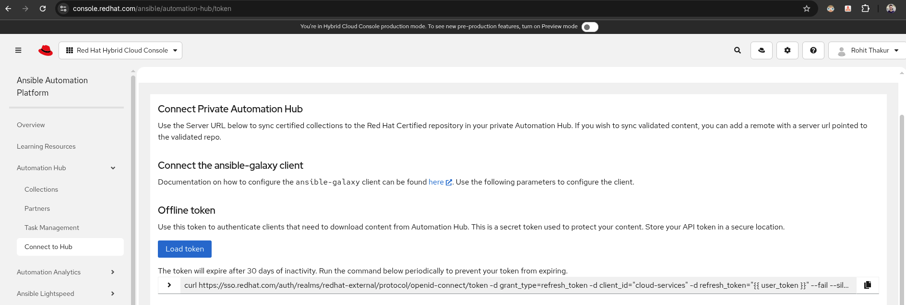

# Ansible Builder (Official Downstream Docs)

## Chapter 1. Introduction

### 1.1 What is Ansible Builder?
Ansible Builder is a command-line tool that automates the process of building Execution Environments by using the schemas and tooling defined in various Ansible Collections, as well as by the user.

### 1.2 Why Use Ansible Builder?
Before Ansible Builder was developed, Automation Platform users would potentially run into dependency issues and multiple error messages when attempting to create a container with all required dependencies installed.

Through the use of an easily customizable definition file, Ansible Builder installs Ansible, specified Collections, and any dependencies (both pip and system-level) so that all necessary requirements to run jobs successfully are fulfilled behind the scenes.

---

## Chapter 2. How to Use Ansible Builder

### 2.1 Installation

From **PyPI**:
```bash
pip install ansible-builder
```

From **Red Hat Subscription** (RHEL):
```bash
dnf install ansible-builder
```

Check version:
```bash
ansible-builder --version
# Example output: 3.1.0
```

---

### 2.2 Definition File

A definition file specifies the content included in the Execution Environment container image.

**Example (Schema Version 1):**
```yaml
version: 1
build_arg_defaults:
  EE_BASE_IMAGE: 'registry.redhat.io/ansible-automation-platform-24/ee-minimal-rhel8'

ansible_config: '../ansible.cfg'

dependencies:
  galaxy: requirements.yml
  python: requirements.txt
  system: bindep.txt

additional_build_steps:
  prepend: |
    RUN pip3 install --upgrade pip setuptools
  append:
    - RUN ls -la /etc
```

**Example-(Schema Version 3):**
```yaml
# vc-execution-environment.yml
version: 3

images:
  base_image:
    name: registry.redhat.io/ansible-automation-platform-24/ee-minimal-rhel8:latest

options:
  # <-- this is the key bit
  package_manager_path: /usr/bin/microdnf

dependencies:
  galaxy: vc-requirements.yml       # your collections (validated/published + git refs)
  python: requirements.txt          # your extra Python deps
  # system: bindep.txt              # uncomment if you have system packages

# Put ansible.cfg into the build context and copy it in before galaxy installs,
# so your validated/published servers + token are honored.
additional_build_files:
  - src: ansible.cfg
    dest: configs/

additional_build_steps:
  # Upgrade packaging tools in the base stage (optional but common)
  prepend_base:
    - RUN pip3 install --upgrade pip setuptools

  # Make ansible.cfg available for the **galaxy** install phase
  prepend_galaxy:
    - COPY _build/configs/ansible.cfg /etc/ansible/ansible.cfg
    - ENV ANSIBLE_CONFIG=/etc/ansible/ansible.cfg

  # (Optional) sanity; see what got installed
  append_final:
    - RUN ansible-galaxy collection list

```

---

### 2.3 Breakdown of Definition File Content

#### Build Args and Base Image
- `ANSIBLE_GALAXY_CLI_COLLECTION_OPTS`: Install pre-release collections or disable SSL verification.
- `EE_RUNNER_IMAGE`: Parent image for the Execution Environment.
- `PYTHON_BUILDER_IMAGE`: Image used for compiling tasks.

CLI `--build-arg` overrides values in the file.

#### Ansible Config File Path
Include private Automation Hub credentials via `ansible.cfg`:
```ini
[galaxy]
server_list = automation_hub, validated, community

[galaxy_server.automation_hub]
url=https://console.redhat.com/api/automation-hub/content/published/
auth_url=https://sso.redhat.com/auth/realms/redhat-external/protocol/openid-connect/token
token=<token>

#[galaxy_server.release_galaxy]
#url=https://galaxy.ansible.com/

[galaxy_server.validated]
url=https://console.redhat.com/api/automation-hub/content/validated/
auth_url=https://sso.redhat.com/auth/realms/redhat-external/protocol/openid-connect/token
token=<token>

[galaxy_server.community]
url=https://galaxy.ansible.com
```

**Load Token**



#### Dependencies

**Galaxy (`requirements.yml`):**
```yaml
collections:
  - name: ansible.netcommon
  - name: ansible.scm
  - name: ansible.utils
  - name: junipernetworks.junos
  - name: cisco.ios
  - name: cisco.iosxr
  - name: cisco.nxos
  - name: vyos.vyos
  - name: arista.eos
  - name: git+https://github.com/redhat-cop/network.base
  - name: git+https://github.com/redhat-cop/network.backup
  - name: git+https://github.com/redhat-cop/network.ospf
  - name: git+https://github.com/redhat-cop/network.bgp
  - name: git+https://github.com/redhat-cop/network.interfaces
```

**Python (`requirements.txt`):**
```
packaging>=23.2
setuptools>=68
wheel
junos-eznc
jsnapy
jxmlease
ncclient==0.6.15

```

**System (`bindep.txt`):**
```
libxml2-dev [platform:dpkg]
libxml2-devel [platform:rpm]
libxml2-utils [platform:dpkg]
subversion [platform:rpm]
subversion [platform:dpkg]
```

---

### 2.4 Executing the Build and Create Commands

**Build EE:**
```bash
ansible-builder build
```

**Create Containerfile without build:**
```bash
ansible-builder create
```

**Build with a tag:**
```bash
ansible-builder build -t my_first_ee_image
```

**Build using a specific file:**
```bash
ansible-builder build -f another-definition-file.yml -t another_ee_image
```

Check more options:
```bash
ansible-builder build --help
```

---

## Chapter 3. Where and How Execution Environments Get Published

### 3.1 Pushing to a Container Image Registry

**Login:**
```bash
podman login -u=[username] -p=[password] --tlsverify=false [automation-hub-url]
```

**Push image:**
```bash
podman push [automation-hub-url]/[ee image name]
```

### 3.2 Pulling from a Protected Registry
- Create container registry credentials in Automation Controller.
- Save and use in job templates.

---

## Chapter 4. Building EE in Action

**Registry Login:**
```bash
podman login registry.redhat.io
podman login brew.registry.redhat.io
podman login quay.io
```

**Build and Push EE:**
```bash
ansible-builder build --tag networking-ee -v 3
podman tag localhost/networking-ee quay.io/rothakur18/networking-ee
podman push quay.io/rothakur18/networking-ee
```

**Build with customization**
```bash
$ ansible-builder build   -f vc-local-execution-environment.yml   -t vc_ee_local:latest   -v 3 --no-cache^C
$ podman images | grep vc_ee_local 

localhost/vc_ee_local                                                                   latest      9209a2c6a861  18 minutes ago     509 MB
$ podman tag vc_ee_local:latest quay.io/rothakur18/vc_ee_local:latest 
$ podman push --format v2s2 quay.io/rothakur18/vc_ee_local:latest 


```

For more details, refer to the official [Execution Environment documentation](https://docs.google.com/document/d/1PHaF-qfxJ8DqpkCaVz8HCeYx2tO3b-6zW8Nr1hS9viw/edit?usp=sharing)


## Removing a Built Execution Environment (EE)

Since you’ve already built `networking-ee`, removing it is just a **podman image removal** step.

### Remove by Image Name
```bash
podman rmi networking-ee
```
### Remove from a Registry Tag
If you also tagged/pushed it to a registry (like quay.io/rothakur18/networking-ee), remove that tag too:
```bash
podman rmi quay.io/rothakur18/networking-ee
```

### Clean All Unused Images
If you want to clean all unneeded images and free disk space:

```bash
podman image prune -a
```